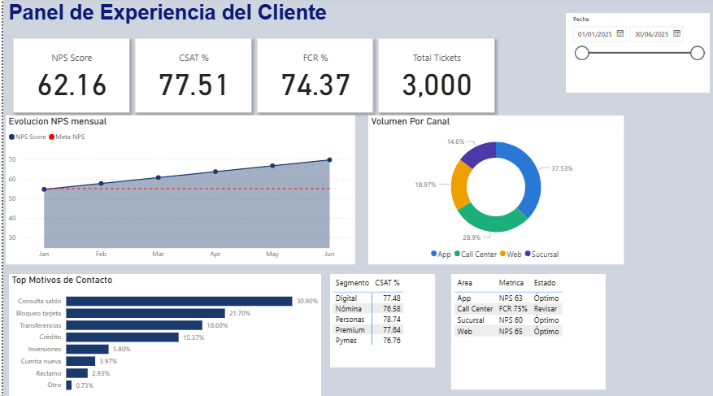

# Panel de Experiencia del Cliente — Banco Nova (Dashboard interactivo en Power BI)

## Objetivo del proyecto

Banco Nova necesita un sistema de inteligencia que integre las señales de experiencia del cliente de múltiples fuentes (encuestas, call center, app, sucursal) en una sola vista ejecutiva. El objetivo es que los equipos de CX y gerencia puedan detectar clientes en riesgo de churn antes de que se vayan, identificar qué procesos generan más insatisfacción y tomar decisiones basadas en datos para mejorar el NPS, CSAT y FCR de forma continua.

---

## Dataset utilizado

- [fact_nps.csv](data/fact_nps.csv)
- [fact_csat.csv](data/fact_csat.csv)
- [fact_interaccion.csv](data/fact_interaccion.csv)
- [dim_cliente.csv](data/dim_cliente.csv)
- [dim_canal.csv](data/dim_canal.csv)
- [dim_tiempo.csv](data/dim_tiempo.csv)

---

## Preguntas / KPIs

- ¿Cuál es el NPS, CSAT y FCR del período y cómo varían mes a mes?
- ¿Qué canal genera mayor satisfacción y cuál tiene más problemas?
- ¿Qué segmento de cliente tiene el CSAT más bajo?
- ¿Cuáles son los principales motivos de contacto y cuáles generan más insatisfacción?
- ¿Qué clientes están en riesgo de churn este mes?
- ¿El FCR del call center está por encima o debajo de la meta?
- ¿Cuál es la tendencia del NPS en los últimos 6 meses vs. la meta de 55 puntos?
- ¿Qué porcentaje de interacciones se resuelven en el primer contacto?

---

## Proceso

- Generación y limpieza del dataset con distribuciones estadísticas representativas de banca retail
- Construcción del modelo estrella en SQL Server (3 fact tables + 3 dimensiones)
- ETL con stored procedure de carga incremental, control de duplicados y log de auditoría
- Creación de medidas DAX para NPS, CSAT, FCR, delta MoM y churn scoring
- Conexión de Power BI a las vistas `vw_cx_dashboard` y `vw_alertas_cx`
- Diseño del dashboard con fondo corporativo, paleta consistente y layout ejecutivo
- Aplicación de slicers de fecha para análisis dinámico por período

---

## Dashboard

[Ver Dashboard](docs/dashboard_preview.png)

---

## Insights del proyecto

- Los canales digitales (App + Web) concentran el **56% del volumen** de interacciones, pero el segmento Digital tiene el CSAT más bajo con **67%** — oportunidad crítica de mejora en UX
- **Consulta de saldo** lidera los motivos de contacto con 30.9% — candidato principal para automatización vía chatbot o self-service
- El segmento **Premium** tiene el CSAT más alto (91%) mientras **Pymes** muestra el FCR más bajo, indicando procesos de soporte B2B que necesitan revisión
- El NPS creció de **33 en enero a 62 en junio** (+29 puntos), superando la meta de 55 en el segundo trimestre
- El **FCR del Call Center (74.4%)** está por debajo de la meta del 75% — cada punto porcentual de mejora equivale a ~30 interacciones menos por mes que se pueden evitar

---

## Conclusión final

Para mejorar la experiencia del cliente en Banco Nova, la estrategia debe enfocarse en tres frentes simultáneos: automatizar los motivos de contacto de alto volumen y bajo valor (consulta de saldo, transferencias) para liberar capacidad del call center; intervenir proactivamente en el segmento Digital con mejoras de UX en la app, dado que concentra alto volumen pero el CSAT más bajo; y activar el modelo de churn scoring para que el equipo de retención contacte esta semana a los clientes con NPS histórico menor a 4 antes de que migren a la competencia. Estas tres acciones, ejecutadas en paralelo, tienen el mayor potencial de impacto medible en NPS, CSAT y FCR en el corto plazo.

---

## Tech Stack

